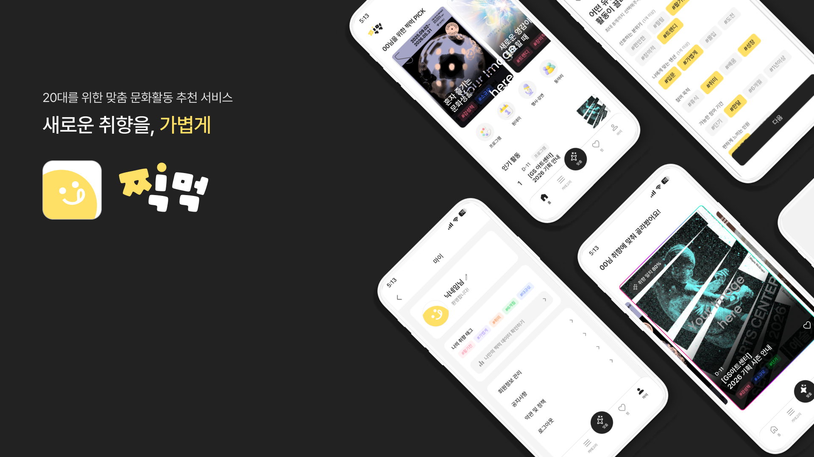
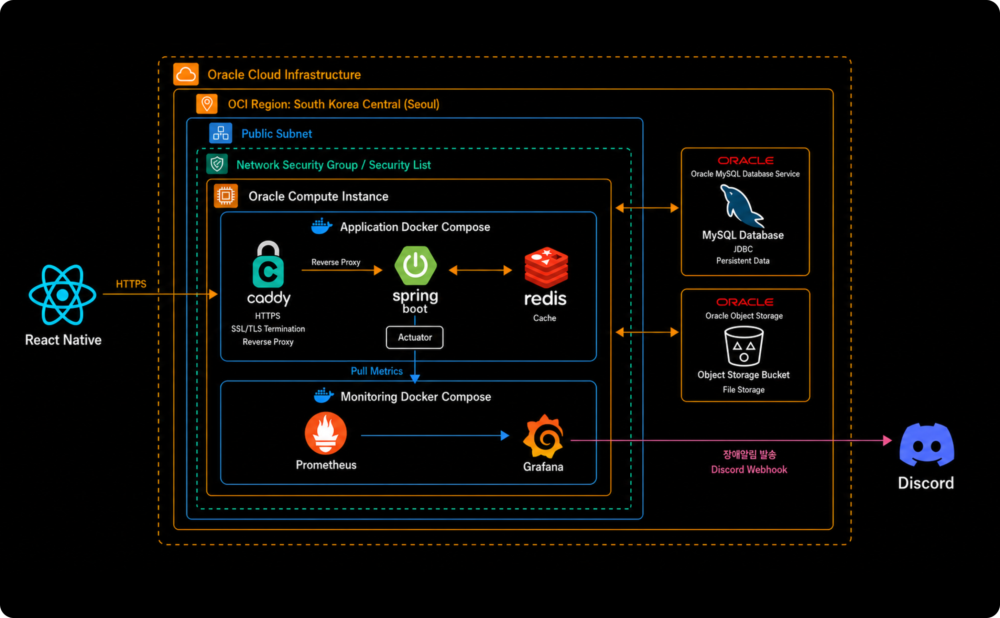
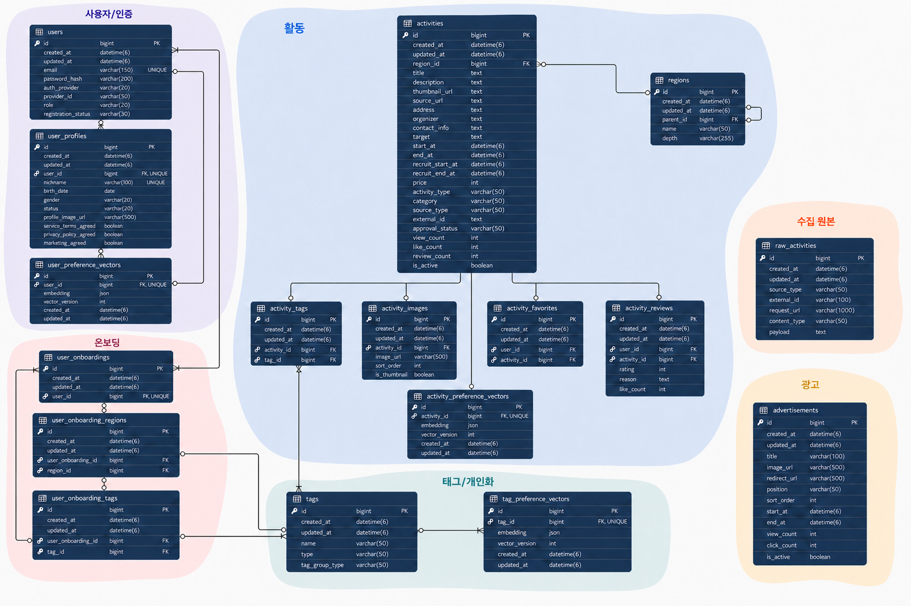

<div align="center">

# 찍먹 Backend

### 새로운 취향을, 가볍게

20대를 위한 맞춤 문화활동 추천 서비스

<br />



</div>

---

## 📖 프로젝트 소개

### 취향과 지역을 바탕으로 새로운 문화활동을 발견하는 서비스, 찍먹

찍먹(JJICK-MEOK)은 사용자의 관심 주제, 취향 태그, 활동 지역을 바탕으로 문화·여가 활동을 탐색하고 추천하는 서비스입니다.

- 관심 지역·주제·취향을 온보딩에서 선택하고 개인화 추천에 활용합니다.
- 홈, 카테고리, 맞춤 추천, 찜, 상세 페이지에 필요한 데이터를 화면 단위 API로 제공합니다.
- 활동 유형·카테고리·지역·키워드·태그를 기준으로 활동을 검색하고 필터링할 수 있습니다.
- 공공 API와 웹 검색 결과를 수집·정규화하고, 검수된 활동을 자동으로 발행합니다.
- 찜, 후기, 활동 이미지와 광고를 함께 관리해 탐색 경험을 구성합니다.

---

## 🛠 기술 스택

| 분류 | 기술 |
|---|---|
| **Language** | [](https://openjdk.org/) |
| **Framework** | [](https://spring.io/projects/spring-boot) [](https://spring.io/projects/spring-security) [](https://spring.io/projects/spring-data-jpa) [](https://spring.io/projects/spring-ai) |
| **Database** | [](https://www.mysql.com/) [](https://redis.io/) [](https://valkey.io/) |
| **Migration** | [](https://documentation.red-gate.com/flyway) |
| **Auth** | [](https://oauth.net/2/) [](https://jwt.io/) [](https://developers.google.com/identity) [](https://developers.kakao.com/) [](https://developers.naver.com/) |
| **AI & External** | [](https://openai.com/) [](https://developers.google.com/sheets/api) [](https://serper.dev/) |
| **Storage** | [](https://www.oracle.com/cloud/storage/object-storage/)  |
| **Docs** | [](https://swagger.io/) [](https://spring.io/projects/spring-restdocs) |
| **Test** | [](https://junit.org/junit5/) [](https://site.mockito.org/) [](https://www.h2database.com/) |
| **Build & Deploy** | [](https://gradle.org/) [](https://www.docker.com/) [](https://docs.docker.com/compose/) [](https://github.com/features/actions) [](https://github.com/features/packages) |
| **Infra** | [](https://www.oracle.com/cloud/) [](https://caddyserver.com/) |
| **Monitoring** | [](https://prometheus.io/) [](https://grafana.com/) [](https://discord.com/) |

---

## 📡 아키텍처

<div align="center">
  
</div>

- React Native 클라이언트 요청을 Caddy가 HTTPS로 수신하고 Spring Boot 애플리케이션으로 전달합니다.
- 애플리케이션과 캐시는 OCI Compute의 Docker Compose 환경에서 실행합니다.
- 영속 데이터는 Oracle MySQL Database Service, 파일은 OCI Object Storage에 저장합니다.
- GitHub Actions가 이미지를 GHCR에 발행하고 OCI Compute에 배포합니다.
- Prometheus와 Grafana로 메트릭을 시각화하고 Discord Webhook으로 장애 알림을 전달합니다.

## 🗂️ ERD

<div align="center">
  
</div>

상세 컬럼, 제약조건과 관계 정의는 [`docs/current-entity-erd.dbml`](./docs/current-entity-erd.dbml)에서 확인할 수 있습니다.

---

## 📁 패키지 구조

```text
src/main/java/com/jjikmeok/app/
├── AppApplication.java
├── domain/
│   ├── activity/          # 활동 CRUD·검색·추천, 공공/민간 데이터 수집 및 발행
│   ├── advertisement/     # 광고 노출 및 관리자 CRUD
│   ├── ai/                # 수집 후보의 OpenAI 기반 분석
│   ├── auth/              # 로컬/OAuth 인증, JWT, 이메일 인증, 비밀번호 재설정
│   ├── favorite/          # 사용자 활동 찜
│   ├── image/             # 활동 이미지와 노출 순서 관리
│   ├── onboarding/        # 관심 지역·주제·취향 선택 및 조회
│   ├── page/              # 홈·카테고리·맞춤·찜·상세 화면 조합 API
│   ├── personalization/   # 취향 유형 및 코사인 유사도 기반 개인화 추천
│   ├── region/            # 시/도·시/군/구 계층형 지역 관리
│   ├── review/            # 활동 후기 CRUD
│   ├── tag/               # 활동·주제·취향 태그 사전 관리
│   └── user/              # 사용자 계정과 프로필
└── global/
    ├── common/            # 공통 응답, 예외, JPA 감사 엔티티
    ├── config/            # Security, CORS, Redis, Swagger, Async 설정
    ├── infra/             # 메일 및 Local/OCI Object Storage 연동
    └── security/          # JWT 필터·토큰·인증/인가 예외 처리
```

---

## 🔑 주요 기능

### 인증 및 사용자

- 이메일 회원가입·로그인과 BCrypt 비밀번호 암호화
- Google, Kakao, Naver OAuth 2.0 로그인
- 웹 리다이렉트와 모바일 딥링크를 지원하는 일회용 Handoff Token 교환
- JWT Access/Refresh Token 발급·회전·로그아웃, Redis 기반 Refresh Token 검증
- 이메일 인증 코드 발송과 비밀번호 재설정
- 닉네임, 생년월일, 성별, 상태, 약관 동의를 포함한 프로필 생성·조회

### 온보딩 및 개인화

- 관심 주제, 취향 태그, 활동 지역 선택 및 전체 교체 방식 수정
- 가입 상태를 프로필 완료와 온보딩 완료 단계로 관리
- 사용자 온보딩 태그를 바탕으로 취향 유형 분류
- 취향 태그 ID 순서로 사용자·활동 이진 벡터를 생성하고 코사인 유사도로 추천 점수 계산
- 개인화 점수, 모집 마감일, 찜 여부, 태그를 포함한 맞춤 활동 추천

### 활동 탐색 및 화면 큐레이션

- 활동 유형, 카테고리, 지역, 키워드, 태그 기반 검색·필터링
- 모집 중이고 승인된 활동을 대상으로 최신순·인기순·마감순 정렬
- 상세 조회 시 조회수 증가와 지역·태그·이미지·찜 상태 조합
- 홈의 최신/인기 활동 및 취향 큐레이션, 카테고리·맞춤·찜·상세 화면 API
- 활동 기간, 모집 기간, URL, 승인 상태 검증과 관리자 CRUD

### 활동 수집 및 발행 파이프라인

- KOPIS, 전시, 서울 문화행사, 서울 공공예약 API 동기화
- 외부 응답을 `raw_activities`에 원본 보관한 뒤 공통 활동 모델로 정규화
- Serper 검색, robots 정책 확인, URL 품질 평가, 메타데이터 추출, 중복 제거
- Spring AI/OpenAI를 이용한 Discovery 후보 분석과 활동 정보 구조화
- Google Sheets에 수집 후보를 적재하고 검수 완료 데이터를 서비스 DB로 발행
- 공공 데이터 수집 및 Discovery 수집·발행 스케줄러 제공

### 찜·후기·이미지

- 사용자별 활동 찜 등록·조회·삭제 및 저장순·마감순 정렬
- 사용자당 활동별 하나의 후기 작성, 수정, 삭제 및 페이지 조회
- 활동별 다중 이미지, 썸네일 여부, 노출 순서 관리
- 찜·후기 수 집계와 중복 등록 방지

### 광고 및 운영

- 노출 위치와 기간을 기준으로 활성 광고 조회, 관리자 CRUD
- Local File Storage와 OCI Object Storage를 환경별로 선택
- Caddy 기반 HTTPS 종료와 Docker Compose 기반 애플리케이션·캐시 운영
- GitHub Actions를 통한 Docker 이미지 빌드, GHCR 푸시, OCI Compute 자동 배포
- Prometheus·Grafana 모니터링과 Discord Webhook 장애 알림 구성

---

## 🧪 테스트

Controller, Service, Repository, Security, Storage, 개인화 계산 및 수집 파이프라인을 중심으로 단위·통합 테스트를 구성했습니다.

```bash
# 전체 테스트
./gradlew test

# 컴파일 검증
./gradlew compileJava
```

Swagger UI는 애플리케이션 실행 후 `/swagger-ui/index.html`에서 확인할 수 있습니다.
